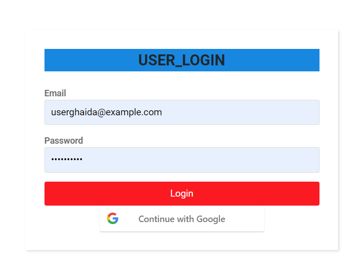
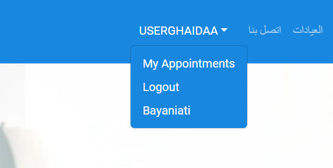
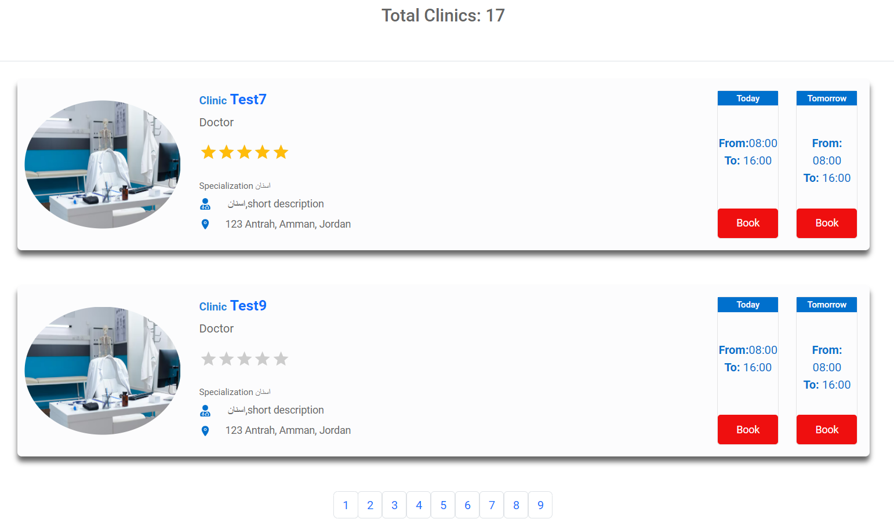
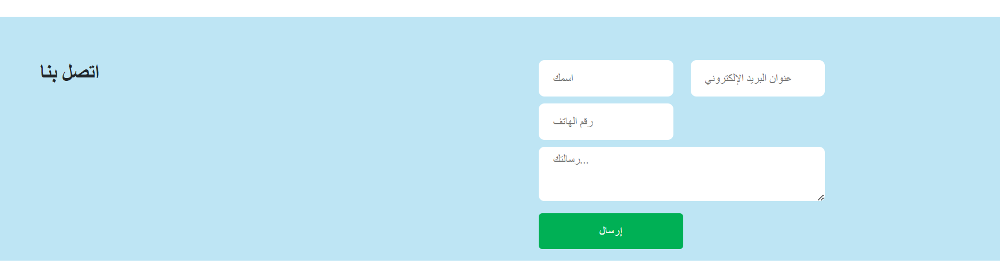
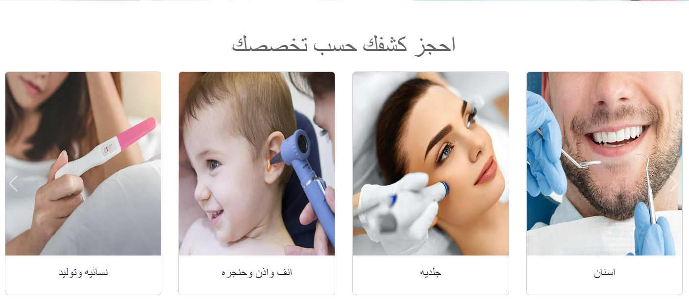

<p align="center">
<a href="https://www.meraki-academy.org" target="_blank" rel="noopener noreferrer">
 
 </a>
</p>

<h3 align="center">Loving Hands
</h3>

---

<p align="center">Loving Hands is an online platform designed to streamline the process of scheduling appointments 
    <br> 
<!-- <a href=''>Demo</a> -->
    <br> 
</p>

## 📝 Table of Contents

- [About](#about)
- [Getting Started](#getting_started)
- [Usage](#usage)
- [Built Using](#built_using)
- [User Story](#user_story)
- [Data Flow](#data_flow)
- [Guided By](#guided_by)

## 🧐 About <a name = "about"></a>

Ex. Are you looking for a quick and easy way to booking appointments from anywhere at any time, reducing the need for phone calls or in-person visits ,? The **(Loving Hands)** is the greatest and most accurate application to do this for you. It helps you to view available appointment slots and book appointments with their preferred doctors, users can create accounts,and update their personal information.
. The **(Loving Hands)** provides a simple design to ensure having the best user experience.

## 🏁 Getting Started <a name = "getting_started"></a>

These instructions will get you a copy of the project up and running on your local machine for development and testing purposes.

### Prerequisites

- Visual Studio Code follow this <a href='https://code.visualstudio.com/download'>link</a> to install.
- Git Bash follow this <a href='https://git-scm.com/downloads'>link</a> to install.
-PostgreSQL follow this <a href='https://www.elephantsql.com/'>link</a> to install.
- Node.js follow this <a href='https://nodejs.org/en/download/package-manager'>link</a> to install.
- Postman follow this <a href='https://www.postman.com/downloads/'>link</a> to install.

### Installing:

1. Clone the repo to your local machine using git bash.

```
git clone https://github.com/Loving-Hands/MERAKI_Academy_Project_5.git
```

2. Install packeges repeat this step in backend and frontend folder

```
npm i
```

3. Run server using git bash inside backend folder

```
npm run dev
```

4. Run application using git bash inside frontend folder

```
npm run dev
```
5. copy link from bash in frontend server <a href='http://localhost:5173'>link</a> to run application on browser.

Now app ready to use

## 🎈 Usage <a name="usage"></a>
Ready to experience the convenience of the Clinic Appointment Booking System? Visit our website to register and schedule your next appointment with ease .

- You have to register to be able to book appointment with your doctor


- You can click on the **Loving Hands** Logo provided in the navigation  bar to view the home section.

- You can click on the **User_Register** button to create new account.


- You can click on the **User_Login** button then click on your name to show your information and appointments.


-You click on My Appointments will show all your appointments ,and you can cancle it.



- You can click on **Show diagnosis** will show the report from your doctor about your status.
- You can **Login** with your google account.
- you can click on **clinics** button to show all clinics in our application.


- You can click on **call Us** to give us feedback or any problem you have when using our application.


- You can click on **Image_of_Specialization** provided in slider-show to show all clinics in this section.

- Whhen you click on **picture_of_clinic** ,will show the information of clinic .


- You can book **appointment** from clinic page .


- You can **rating clinic and write comment** in clinic page.


- You can also view the comments of clinic from highRate to lowerRate.


- Our application has **adminDashbord** , where only admin can login to this page.


- Admin can delete user,clinic,specialization.
- Admin can add new specialization , and update name or image of specialization.


- Are you a doctor ? so you can create an account to your clinic by **Doctor_Register** .


- As a doctor you can add **diagnosis** for each patient, and you can show all appointments you have in your clinic.


## ⛏️ Built Using <a name = "built_using"></a>

- [ElephantSQL](https://www.elephantsql.com/) - Database
- [Express JS](https://expressjs.com/) - Server Framework
- [Redux ](https://redux.js.org/) - Web Framework
- [Node JS](https://nodejs.org/en/) - Server Environment

## User Story <a name = "#user_story"></a>

Your trello board link
<a href='https://trello.com/b/wER41UBe/team-2-khateeb-ghaidaa-ahmad'>Trello</a>

## Data Flow <a name = "#data_flow"></a>

</a>

## ⚠️ Guided By <a name = "guided_by"></a>

This project is guided by ©️ **[MERAKI Academy](https://www.meraki-academy.org)**